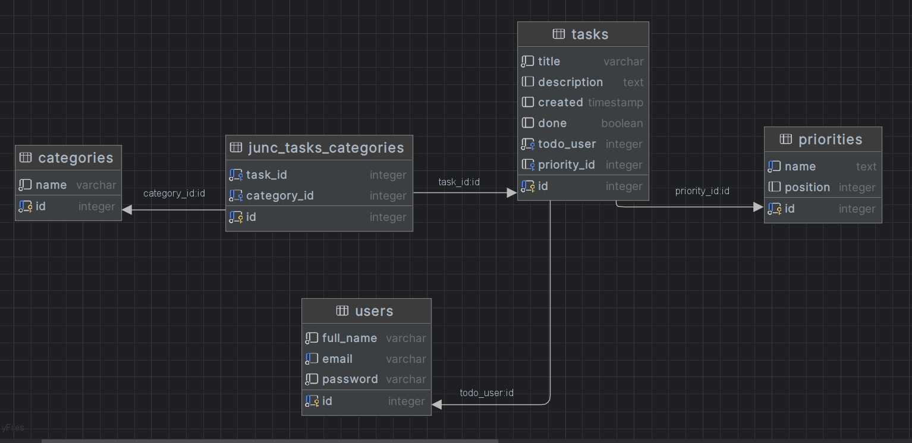

# job4j_todo
## Project on course job4j.ru
### Description
Implementation of the project 'Todo' in accordance with specifications for the Job4j course.
This application is a typical TODO list with tasks and states 'done' or not yet.
There are Todo list pages with a filter by status, possibility create, update, delete tasks, change status to 'done'.
You can choose the priority of a task and multiple categories of Task.
There is User authorization. Each user has their own local time
### Author
Viacheslav Osipov  
[slavaosipov1199@gmail.com](mailto:slavaosipov1199@gmail.com)  
[LinkedIn](https://www.linkedin.com/in/viacheslav-osipov-67806ab3/)

### Database Diagram

### Screenshots

