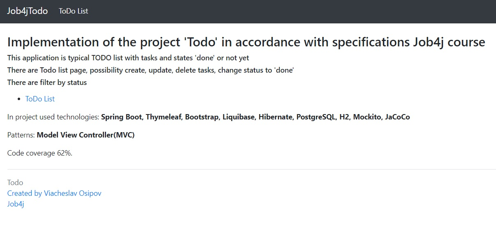
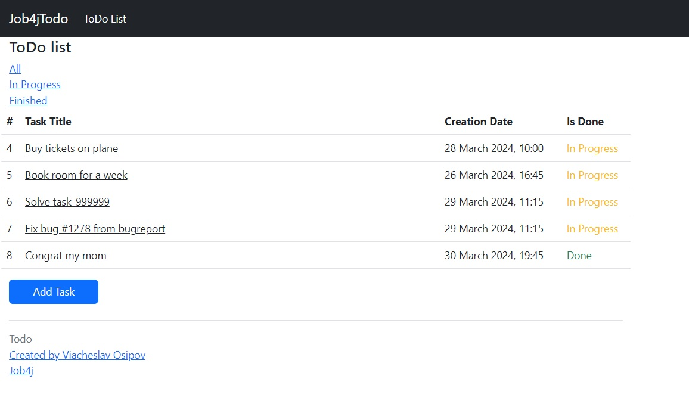
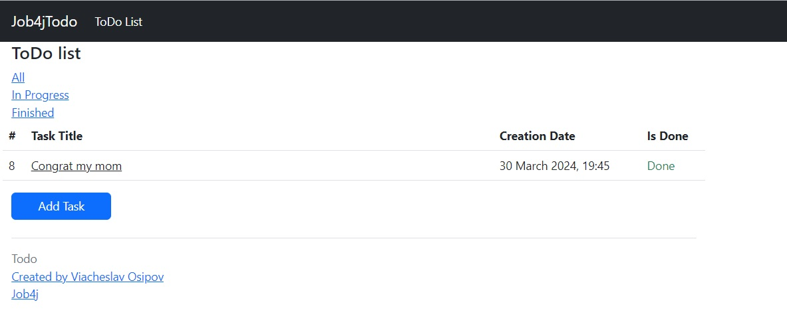
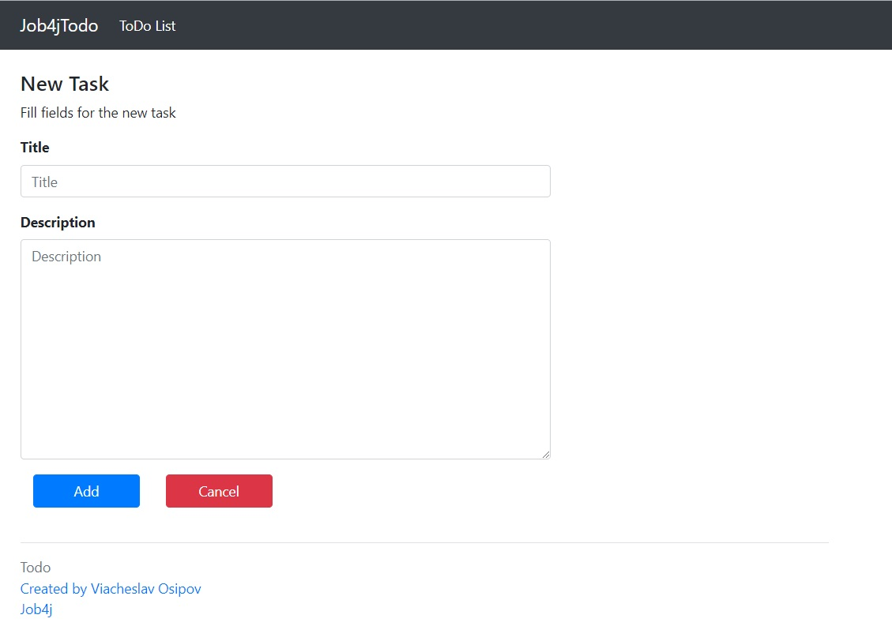
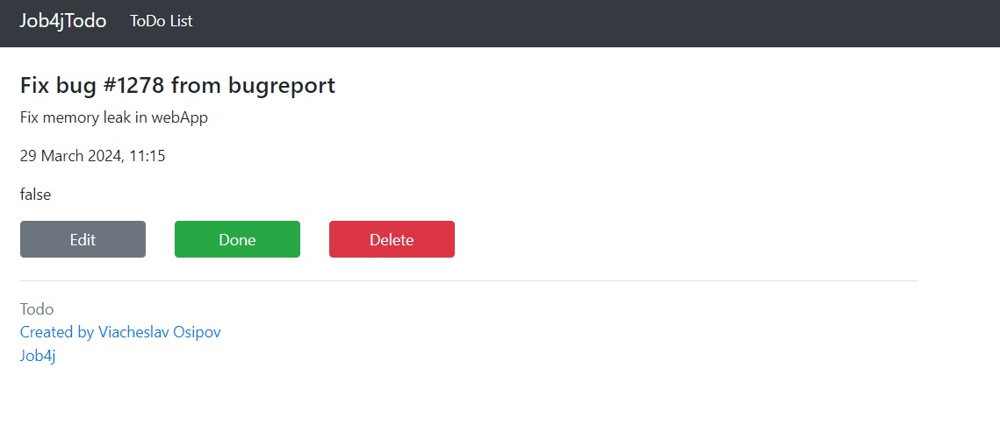
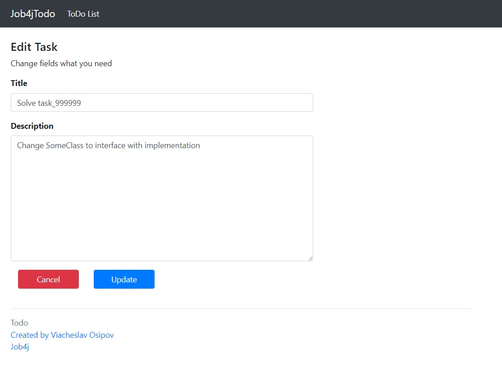
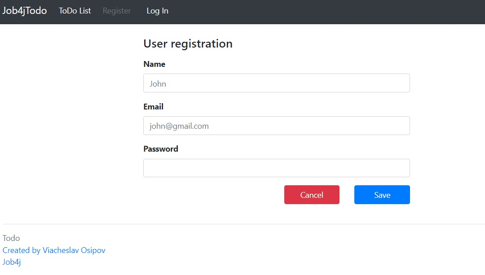
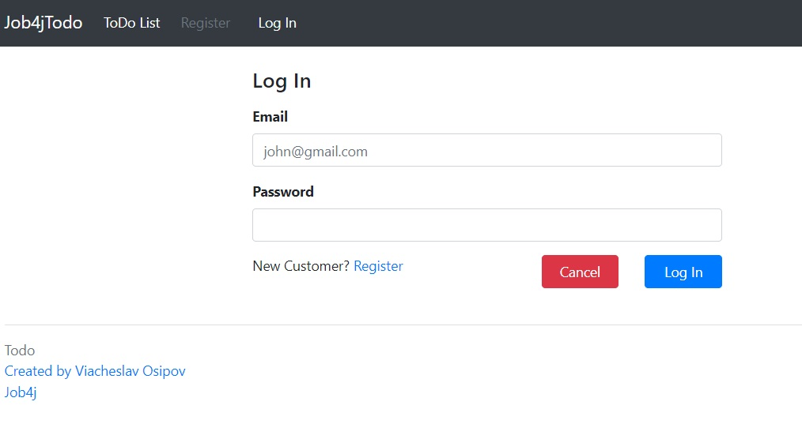

# job4j_todo
## Project on course job4j.ru
### Description

This application is typical TODO list with tasks and states 'done' or not yet
There are Todo list page, possibility create, update, delete tasks, change status to 'done'
There are filter by status. All pages accessible after user authorisation.

### Technologies 
Spring Boot, Thymeleaf, Bootstrap, Liquibase, Hibernate, PostgreSQL, H2, Lombok
Mockito 

### Environment
Java 17, Maven 3.9.2, PostgreSql 16

### Running project
SQL scripts for create tables and insert data:
* /db/scripts/create_tables.sql
* /db/scripts/insert_tables.sql

### Author
Viacheslav Osipov  
[slavaosipov1199@gmail.com](mailto:slavaosipov1199@gmail.com)  
[LinkedIn](https://www.linkedin.com/in/viacheslav-osipov-67806ab3/)

### Screenshots

